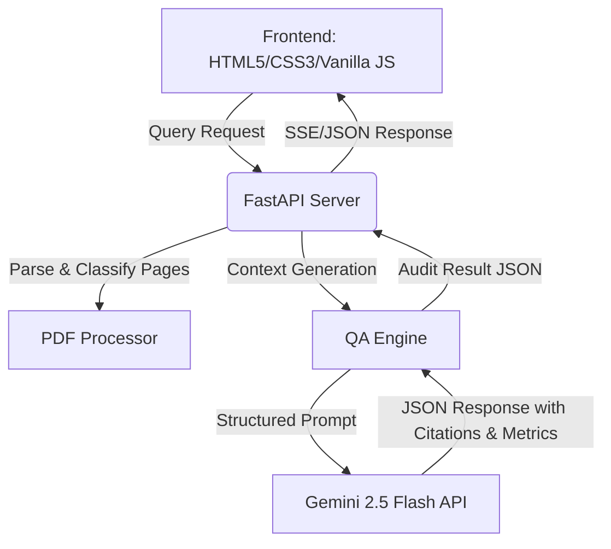

# AI Mortgage QA Auditor (Infrrd Hackathon)

A futuristic, high-fidelity dark-mode web application for automated mortgage document auditing. This application performs page-level logical document parsing, classification, and structured Retrieval-Augmented Generation (RAG) using Gemini to answer QA audit checkpoints with exact page traceability.

## 🌟 Key Features

*   **Split-Screen Interface**:
    *   **Left Panel**: File-tree hierarchy displaying logical document structures (e.g., Bank Statements, W-2s, Closing Disclosures) with page-range mappings and an interactive digital text/PDF reader.
    *   **Right Panel**: Conversational QA chat workspace with glowing quick-access button chips for mortgage benchmark queries.
*   **Logical Page Parsing & Classification**: Heuristic classification of multi-page loan packages into functional documents (W-2s, 1040s, Paystubs, Bank Statements) with confidence metrics.
*   **Exact Page Traceability**: Clicking on citation pills in the chat response instantly navigates the page viewer to the referenced page.
*   **Technical Audit Flow Metrics**: Expandable visualization displaying technical execution attributes, including representation matrices, table lattice extraction states, processing semaphores, token entropy confidence, and cross-document data covariance.

---

## 🛠️ Architecture & Tech Stack



*   **Frontend**: Vanilla HTML5, Custom Glassmorphism styling (CSS3), and lightweight state management (Vanilla JS).
*   **Backend**: Python (FastAPI, Uvicorn).
*   **Document Processing**: `pypdf` for logical page demarcation and heuristic category labeling.
*   **AI Inference**: `google-generativeai` utilizing the `gemini-2.5-flash` model running structured JSON schema outputs.

---

## 🚀 Getting Started

### Prerequisites

*   Python 3.9+
*   A Gemini API Key (obtained from [Google AI Studio](https://aistudio.google.com/))

### Installation & Run

1.  **Clone the Repository**:
    ```bash
    git clone https://github.com/VARUN-NAYAKA/Infrrd-Hackathon.git
    cd Infrrd-Hackathon
    ```

2.  **Install Dependencies**:
    ```bash
    pip install -r requirements.txt
    ```

3.  **Set Environment Variable (Optional)**:
    You can set your Gemini API key in your environment, or enter it directly in the UI Settings modal:
    *   **Windows (PowerShell)**:
        ```powershell
        $env:GEMINI_API_KEY="your-api-key-here"
        ```
    *   **Linux/macOS**:
        ```bash
        export GEMINI_API_KEY="your-api-key-here"
        ```

4.  **Launch the Server**:
    ```bash
    python main.py
    ```

5.  **Access the App**:
    Open [http://127.0.0.1:8001/](http://127.0.0.1:8001/) in your browser.

---

## 📑 File Structure

*   `main.py`: FastAPI server setup with `/api/upload`, `/api/query`, and file-serving endpoints.
*   `pdf_processor.py`: Demarcates PDF pages and classifies them into structured document nodes.
*   `qa_engine.py`: Handles structured prompts, token safety, JSON formatting, and interactions with Gemini.
*   `mock_data.py`: Pre-loaded 9-page sample loan package (Chase Bank statement, W-2, Paystubs, Form 1040, Closing Disclosure) for immediate testing.
*   `static/`:
    *   `index.html`: Layout with glassmorphism panels.
    *   `styles.css`: Futuristic dark theme with glowing button states.
    *   `app.js`: Dynamic document trees, keyboard pagination navigation, dynamic chat message streams, and audit flow visualization cards.
