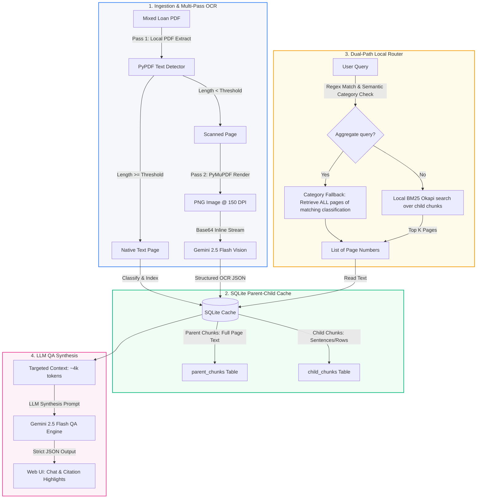
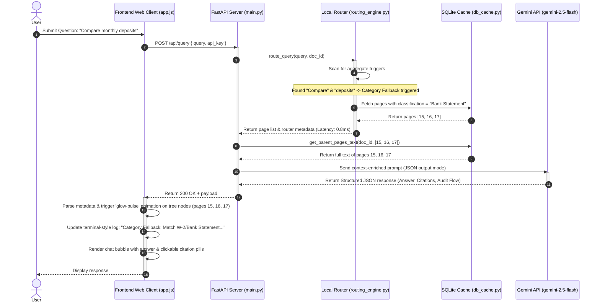

# "Deep Matrix" Mortgage Document Intelligence: System Architecture, Algorithms & Methodologies

This report provides a comprehensive technical breakdown of **Deep Matrix**, a high-efficiency Mortgage Document Intelligence platform. The system processes mixed-format mortgage packages (containing both native digital pages and scanned/photographed records) and answers audit queries using a low-latency, hybrid retrieval-augmented generation (RAG) architecture.

---

## 🏛️ 1. High-Level Architecture Overview

Deep Matrix separates document parsing from real-time question answering, utilizing a persistent local cache to maintain a parent-child hierarchical document structure.



---

## ⚙️ 2. Core Modules & Algorithmic Breakdown

### A. Hybrid Multimodal Ingestion Pipeline

To handle files containing mixed-format pages (e.g., a native digital Closing Disclosure alongside a scanned bank statement page) efficiently and cost-effectively, Deep Matrix runs a **two-pass ingestion pipeline**:

1. **Pass 1: Local PyPDF Parsing (Fast, Free)**
   - Text is extracted using `pypdf`.
   - **Scanned Page Decision Boundary**: If the extracted text contains fewer than $50$ characters (`SCANNED_PAGE_TEXT_THRESHOLD = 50`), it is classified as a scanned/photographed page and queued for Pass 2. Otherwise, it is treated as a native digital page.
   - For native digital pages, classification is performed using fast, local keyword-matching heuristics, and simple summaries are generated programmatically to avoid LLM API costs.

2. **Pass 2: Multimodal Gemini Vision OCR (Accurate, Visual)**
   - Scanned pages are rendered into PNG images using `PyMuPDF` (fitz) at $150$ DPI, balancing text clarity (grid structures, numbers) and image size.
   - Images are converted to base64 inline strings and sent directly to `gemini-2.5-flash` in batches of $5$. Bypassing the File API reduces latency and eliminates remote storage overhead.
   - The LLM is instructed to return a structured JSON response containing:
     - Full extracted page text (OCR).
     - Page classification (e.g., `W-2`, `Bank Statement`, `Paystub`, `Closing Disclosure`, `Form 1040`, or `Unknown`).
     - A concise 2-sentence layout summary.
     - High-value key terms (dates, values, names) for index optimization.

---

### B. SQLite Caching Schema & Hierarchy

To support fast offline querying and reduce RAG pipeline latency, the system stores document pages in a hierarchical parent-child format in a SQLite database (`loan_audit_cache.db`):

```
┌───────────────────────────────────────────────┐
│              documents Table                  │
│  (id, name, total_pages, uploaded_at)         │
└──────────────────────┬────────────────────────┘
                       │ 1
                       │
                       │ 1..*
┌──────────────────────▼────────────────────────┐
│            parent_chunks Table                │
│  (id, doc_id, page_number, text_content,      │
│   doc_classification, summary)                │
└──────────────────────┬────────────────────────┘
                       │ 1
                       │
                       │ 1..*
┌──────────────────────▼────────────────────────┐
│             child_chunks Table                │
│  (id, parent_id, page_number, text_segment,   │
│   keywords)                                   │
└───────────────────────────────────────────────┘
```

- **Parent Chunks**: Represent a full page of the document. This is the logical unit retrieved and passed to the LLM context during query synthesis, ensuring the LLM receives the full surrounding page context.
- **Child Chunks**: Sub-page segments (~100 tokens or ~350 characters) split using sentence-boundary punctuation regex: `re.split(r'(?<=[.!?])\s+', text)`. These smaller windows are indexed for keyword searching, preventing long page layouts from diluting scoring statistics.

---

### C. Dual-Path Local Query Router

When a query is received, the system determines the best path to find relevant pages using a dual-path routing engine:

#### 1. Category Aggregate Fallback (Heuristic Path)
For queries requiring calculations over an entire document type (e.g., *"Compare checking deposits across all statements"* or *"List every wage statement"*), standard chunk-level search might miss relevant pages.
- **Trigger**: The router scans the query for aggregate indicators (`all`, `compare`, `total`, `summary`, `across`, etc.) and document type keywords.
- **Action**: If a match is found, the router executes a direct SQL query to pull **every page** belonging to that category (e.g., all W-2 pages) in under $1$ ms, bypassing BM25 entirely.

#### 2. BM25 Okapi Retrieval (Search Path)
For specific, targeted questions (e.g., *"What is Benjamin's monthly salary on page 24?"*), the engine tokenizes the query and evaluates the child chunks using the **BM25 Okapi** algorithm.

##### Mathematical Model of BM25 Okapi:
For a query $Q$ containing search terms $q_1, q_2, \dots, q_n$, the BM25 score of a child chunk document $D$ is calculated as:

$$\text{Score}(D, Q) = \sum_{i=1}^{n} \text{IDF}(q_i) \cdot \frac{f(q_i, D) \cdot (k_1 + 1)}{f(q_i, D) + k_1 \cdot \left(1 - b + b \cdot \frac{|D|}{\text{avgdl}}\right)}$$

Where:
- $f(q_i, D)$ is the frequency of query term $q_i$ in chunk $D$.
- $|D|$ is the length of the chunk in words, and $\text{avgdl}$ is the average length of all chunks in the document corpus.
- $k_1$ is a scaling parameter controlling term frequency saturation (default $1.5$).
- $b$ is a document length normalization parameter (default $0.75$).
- $\text{IDF}(q_i)$ is the inverse document frequency of the term $q_i$:

$$\text{IDF}(q_i) = \ln \left( \frac{N - n(q_i) + 0.5}{n(q_i) + 0.5} + 1 \right)$$

where $N$ is the total number of chunks in the corpus, and $n(q_i)$ is the number of chunks containing $q_i$.

The top 2 matching pages (mapped from the top-scoring child chunks) are retrieved.

---

### D. QA Synthesis & Structured JSON Extraction

The parent page texts retrieved by the router are assembled into an XML-like structure (`--- START OF PAGE X [Type] ---`) and passed to `gemini-2.5-flash` with a system instruction that enforces strict schema validation using JSON Mode:

```json
{
  "answer": "Direct, precise answer based strictly on context.",
  "citations": [24],
  "confidence": "high",
  "reasoning": "Detailed audit steps.",
  "audit_flow": {
    "matrices": { "description": "Embedding/keyword similarity validation notes.", "score": 0.95 },
    "lattice": { "description": "Table structural grid analysis notes.", "score": 0.85 },
    "semaphore": { "stages": [...] },
    "entropy": { "score": 0.75, "level": "low" },
    "covariance": { "description": "Form correlation cross-checks.", "score": 0.90 }
  }
}
```

---

## 🔄 3. End-to-End Query Sequence Flow

The diagram below details the sequence of operations that occur from the moment a user submits a query to the final frontend update.



---

## 🎨 4. Frontend Visual Indicators (Audit Trail)

To show users which pages were selected by the local router, the UI implements a **visual audit trail**:

- **Pulsing Node Glow**: When pages are returned in the query response metadata, the frontend identifies the corresponding items in the left-side document tree and applies a glowing CSS outline (`@keyframes glow-pulse` in `styles.css`) using a cyan/teal gradient.
- **Routing Logs**: A terminal-style box displays details about the routing decision (e.g., BM25 scores, fallback strategy, and routing latency in milliseconds) above the answer bubble.
- **Interactive Pill Citations**: Citation numbers are rendered as clickable buttons. Clicking a pill automatically scrolls the left-side text panel to the cited page.
