# Final Specification: Hybrid RAG Architecture & 3-Hour Developer Roadmap

This document serves as the final system specification, detailed 3-hour developer roadmap, and master generation prompt for the **AI Mortgage QA Auditor** utilizing the **Logical DOM Schema & Hybrid Routing RAG** approach.

---

# 📐 Part 1: Hybrid RAG System Specification

```mermaid
graph TD
    subgraph Ingestion Phase [One-Time Setup]
        PDF[Raw Loan PDF] -->|PyMuPDF Parser| Pages[Page Splitting]
        Pages -->|Rule-Based Parser| DocMap[Build Logical DOM Tree]
        Pages -->|Parent Chunks: 1000 tokens| ParentCache[Parent docstore: SQLite]
        Pages -->|Child Chunks: 100 tokens| ChildIndex[Child Embeddings/BM25 Index]
    end

    subgraph Runtime Routing [Under 50ms Local]
        Query[User Question] -->|Hybrid Router| BM25[BM25 Exact Match]
        Query -->|Hybrid Router| MiniLM[Local Sentence Embedding]
        BM25 --> Matcher{Intersection}
        MiniLM --> Matcher
        Matcher -->|Page IDs & Confidence| Breadcrumbs[Visual UI Highlights]
    end

    subgraph Synthesis [Targeted Prompt]
        CacheLookup[SQLite Page Fetch] -->|Retrieve Raw Parent Page Text| Prompter[Build Prompt Context]
        Prompter -->|Mini Context: ~4K tokens| Gemini[Gemini 2.5 Flash]
        Gemini -->|Structured QA JSON| Frontend[Render UI Chat & citation links]
    end
```



## 1. Database Schema (SQLite Cache)
```sql
-- Represents individual uploaded PDFs
CREATE TABLE documents (
    id TEXT PRIMARY KEY,
    name TEXT NOT NULL,
    total_pages INTEGER NOT NULL,
    uploaded_at TIMESTAMP DEFAULT CURRENT_TIMESTAMP
);

-- Parent Chunks: The full text content of a single page (the unit of Synthesis)
CREATE TABLE parent_chunks (
    id TEXT PRIMARY KEY,
    doc_id TEXT NOT NULL,
    page_number INTEGER NOT NULL,
    text_content TEXT NOT NULL,
    doc_classification TEXT NOT NULL,
    summary TEXT,
    FOREIGN KEY(doc_id) REFERENCES documents(id)
);

-- Child Chunks: Sub-segments of a page (sentences/numeric cells) used for Search
CREATE TABLE child_chunks (
    id TEXT PRIMARY KEY,
    parent_id TEXT NOT NULL,
    page_number INTEGER NOT NULL,
    text_segment TEXT NOT NULL,
    keywords TEXT, -- Comma-separated exact tags for BM25
    FOREIGN KEY(parent_id) REFERENCES parent_chunks(id)
);
```

## 2. The Hybrid Routing Logic (Python Blueprint)
```python
from rank_bm25 import BM25Okapi
import numpy as np

class LocalHybridRouter:
    def __init__(self, child_chunks: list):
        self.child_chunks = child_chunks
        
        # Initialize BM25 corpus
        self.corpus = [chunk["text_segment"].lower().split(" ") for chunk in child_chunks]
        self.bm25 = BM25Okapi(self.corpus)
        
        # Local Embedding placeholder (e.g., using a tiny MiniLM-L6 ONNX model)
        # For a 3-hour hackathon, BM25 + keyword lookup acts as the primary router, 
        # falling back to LLM-routing if overlap score is below threshold.
        
    def route_query(self, query: str, top_k: int = 2) -> list:
        query_tokens = query.lower().split(" ")
        scores = self.bm25.get_scores(query_tokens)
        
        # Get indices of top scores
        top_indices = np.argsort(scores)[::-1][:top_k]
        
        matched_pages = []
        for idx in top_indices:
            if scores[idx] > 0.1:  # Threshold
                matched_pages.append({
                    "page_number": self.child_chunks[idx]["page_number"],
                    "text": self.child_chunks[idx]["text_segment"],
                    "score": float(scores[idx])
                })
        return matched_pages
```

---

# 🕒 Part 2: 3-Hour Developer Roadmap

This timeline is structured for rapid deployment of a high-fidelity prototype.

```
00:00 ────────────────── 00:45 ────────────────── 01:30 ────────────────── 02:30 ───────────── 03:00
  │                       │                       │                       │                   │
  ▼                       ▼                       ▼                       ▼                   ▼
[1. SQLite Cache &   [2. Hybrid Router &     [3. UI Visual Glow &     [4. Streaming &     [5. Polish &
  Ingestion Parser]    Gemini QA API]          Breadcrumbs]             Mock QA Datasets]   Deploy]
```

### 1. Phase 1: Database & Ingestion Setup (0m – 45m)
*   **Goal**: Replace in-memory mapping with a persistent SQLite cache and chunking logic.
*   **Tasks**:
    *   Set up SQLite connection helper in a new `db_cache.py`.
    *   Modify `pdf_processor.py` to chunk text:
        *   **Parent**: Full page texts.
        *   **Child**: Sentences/table rows (approx. 100-token blocks).
    *   Store chunks in SQLite upon file upload.

### 2. Phase 2: Hybrid Local Routing & QA Pipeline (45m – 1h 30m)
*   **Goal**: Implement the routing logic that maps user questions to specific page IDs.
*   **Tasks**:
    *   Install `rank-bm25` library.
    *   Write `routing_engine.py` using BM25 to score child chunks.
    *   Modify `qa_engine.py` query path:
        1.  Receive query.
        2.  Call local `routing_engine` to get page IDs.
        3.  Load page text from SQLite.
        4.  Send text to Gemini 2.5 Flash for the answer synthesis.

### 3. Phase 3: Visual Signaling UI Integrations (1h 30m – 2h 30m)
*   **Goal**: Create visual feedback on the frontend so users can see the routing in action.
*   **Tasks**:
    *   **Visual Highlights**: When a query is processing, calculate matching nodes on the frontend and trigger a glowing border/background animation (`@keyframes glow-pulse`).
    *   **Breadcrumb Log**: Render a terminal-style box above the chat answer: `[Routing System]: Matched Page 4 (W-2) & Page 5 (Paystub) via BM25 (Score: 2.84)`.
    *   **Interactive Citation Pills**: Bind click handlers to citation links in answers that scroll the left-side PDF text reader to the corresponding page index.

### 4. Phase 4: Streamlined Flow & Verification (2h 30m – 3h)
*   **Goal**: Test end-to-end user journeys with real files.
*   **Tasks**:
    *   Validate PDF upload handling.
    *   Run test cases for complex multi-page calculations (e.g. cross-referencing total income across W-2s and 1040s).
    *   Confirm styling scales gracefully across split-screen layouts.

---

# 🤖 Part 3: Master Generation Prompt

*Copy and use this prompt in your AI agent workspace to implement the entire architecture:*

```text
Build a full-stack AI Mortgage Document Auditor web application using Python (FastAPI) and a futuristic dark-mode front-end (HTML/CSS/JS).

Backend Specifications:
1. Ingestion Engine: Use pypdf to parse uploaded PDF documents page-by-page. For each page:
   - Extract raw text.
   - Run simple regex-based classification (W-2, Form 1040, Bank Statement, Paystub, Closing Disclosure).
   - Save the full page text in SQLite table 'parent_chunks'.
   - Sub-divide page text into sentences/numeric cell blocks (approx 100 tokens), storing them in table 'child_chunks' with a parent_id link.

2. Hybrid Local Router:
   - On user query, use the python 'rank-bm25' library to run a BM25 keyword search over all 'child_chunks' for the uploaded document.
   - Return the top 2 page numbers containing matching child text.
   - Fetch the raw text of these matched pages (parent chunks) from SQLite.

3. QA Engine:
   - Query Gemini 2.5 Flash API with the retrieved parent page contexts.
   - Instruct the LLM to output a JSON object containing: { "answer": str, "citations": List[int], "confidence": str, "reasoning": str }.

Frontend Specifications:
1. Split-screen Layout: Left side has a Logical Document Tree showing file categories and an interactive page-by-page text viewer. Right side has a premium glassmorphic chat QA window.
2. Visual Signal Matching:
   - When a user query starts, display a terminal breadcrumb log in the chat UI: "Routing matching page indexes..."
   - Highlight the matched categories in the Left-side Document Tree (e.g. a soft pulsing glowing cyan or emerald background border) to visually communicate which files the router selected.
3. Interactive Navigation: Ensure that when citation pills in the chat response are clicked, the Left-side Page Viewer instantly scrolls to the cited page.

Create clean, well-commented modules (main.py, pdf_processor.py, qa_engine.py, db_cache.py, and static files index.html, styles.css, app.js).
```
