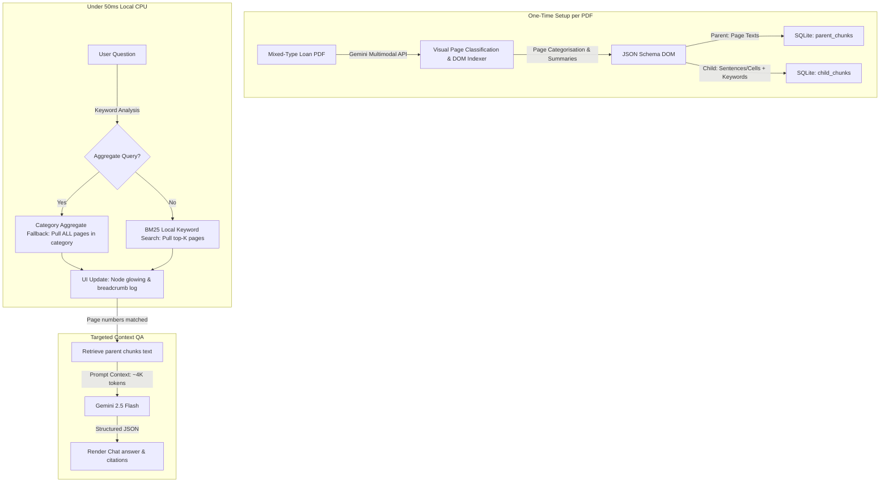

# Mortgage QA Auditor v2 — Premium Futuristic Rebuild (Multimodal Hybrid RAG)

Rebuild the existing `infrd` prototype into a production-quality, visually stunning Mortgage QA Auditor in the `infrd 2` workspace. This plan details the finalized **Option C: Multimodal Hybrid RAG** architecture, specifically designed to handle mixed-type PDF files (native digital text and scanned/photographed pages) with maximum token efficiency and low-latency query routing.

---

## 🏛️ System Architecture: Option C



---

## ⚖️ Architecture Performance Comparisons

| Metric | Option A: Baseline (Full Text Context) | Option B: Basic RAG (Local PDF Parser) | Option C: Multimodal Hybrid RAG (Finalized) |
| :--- | :--- | :--- | :--- |
| **Scanned Document Support** | Fails completely (extracts no text). | Fails (requires running local OCR first). | **Excellent**: Gemini's vision engine processes checkmarks, signatures, and grids natively. |
| **Ingestion Time** | Instant. | Fast (~1–2s for native text split). | Slow (Gemini processes page screenshots once). |
| **Token Efficiency** | **Very Low**: Sends full PDF size every message. | **Excellent**: Sends only top-K pages. | **Excellent**: Sends only top-K matching pages. |
| **Aggregate Query Support** | Good (sees everything). | Fails (only sees top-K snippets). | **Excellent**: Uses Category Fallback to pull all category pages. |
| **Chat Latency** | Slow (5–8s per message). | **Fast** (1–2s per message). | **Fast** (1–2s per message). |

---

## 🛠️ Implementation Modules

### Backend (Python FastAPI)

#### 1. Database Cache (`db_cache.py`) [SQLite Cache]
Handles connection and writes to local SQLite database `loan_audit_cache.db`:
*   `documents`: Records name, upload hash, and total page count.
*   `parent_chunks`: Stores page-level texts, Gemini-based category classifications (W-2, Paystub, Bank Statement, Form 1040), and layout summaries.
*   `child_chunks`: Stores smaller 100-token text segments with keyword mapping.

#### 2. Ingestion Engine (`pdf_processor.py`) [Gemini Multimodal parser]
*   Converts PDF pages into images or uploads the PDF directly using Gemini's native File API.
*   Invokes Gemini 2.5 Flash in structured JSON output mode to generate a *logical document map* (the DOM Schema).
*   Stores parent page content and child chunks in `db_cache.py`.

#### 3. Routing Engine (`routing_engine.py`) [Local BM25 + Fallback]
*   **Aggregate Category Fallback**: Detects aggregate queries (e.g. *"Compare deposits across statements"*, *"Total wages"*). Intercepts and retrieves all page numbers matching that category in the SQLite cache.
*   **Local BM25 Matcher**: For targeted queries, runs `rank-bm25` locally on `child_chunks` and returns the top-2 page IDs under 2 milliseconds.

#### 4. QA Synthesis (`qa_engine.py`)
*   Leverages the `routing_engine` to get page numbers.
*   Queries Gemini 2.5 Flash using *only* the retrieved pages as context.
*   Appends routing metadata (selected pages, matching scores, search latency) to the response JSON.

#### 5. Server Entrypoint (`main.py`)
*   Initializes the SQLite tables on startup.
*   Preloads and caches mock mortgage data so routing functions immediately.
*   Exposes endpoints `/api/upload` (Ingestion) and `/api/query` (RAG loop).

---

### Frontend (HTML/CSS/JS)

#### 1. Visual highlights (`static/app.js` & `static/styles.css`)
*   **Breadcrumb Log**: Displays a log card showing: `[Router matched]: Pages 4, 5 (BM25 Match Score: 4.86) [Latency: 2.1ms]` directly above the chat message.
*   **Pulsing Node Glow**: Adds keyframe animations (`glow-pulse`) to tree cards on the left panel (e.g. W-2 node flashes cyan) when corresponding page IDs are routed, providing a visual audit trail.

---

## 📑 Verification Plan

### Automated Routing Verification
Verify the BM25 search and Category Fallback routing logic locally:
```python
import routing_engine
# 1. Verify specific targeted query
pages, meta = routing_engine.route_query("2023 W-2 gross salary", "mock_doc")
assert 4 in pages, "Failed to match W-2 page"

# 2. Verify aggregate query fallback
pages, meta = routing_engine.route_query("compare deposits across bank statement pages", "mock_doc")
assert len(pages) == 3, "Failed to retrieve all bank statements"
```

### Manual Visual Verification
1.  Upload a hybrid digital/scanned PDF.
2.  Submit a query: check that matching categories on the left tree flash a pulsing cyan border.
3.  Click citation pills: verify the text viewer instantly scrolls to the cited page.
