# Mortgage QA Auditor v2 — Premium Futuristic Rebuild (Hybrid RAG Specification)

Rebuild the existing `infrd` prototype into a production-quality, visually stunning Mortgage QA Auditor in the `infrd 2` workspace. This plan outlines the migration from the baseline memory-only full-context RAG to a highly scalable **Logical DOM Schema & Hybrid Local Routing RAG** using SQLite caching and BM25 search.

---

## 🏛️ System Architecture

```mermaid
graph TD
    subgraph Ingestion Phase [One-Time Setup]
        PDF[Raw Loan PDF] -->|PyMuPDF Parser| Pages[Page Splitting]
        Pages -->|Rule-Based Parser| DocMap[Build Logical DOM Tree]
        Pages -->|Parent Chunks: 1000 tokens| ParentCache[Parent docstore: SQLite]
        Pages -->|Child Chunks: 100 tokens| ChildIndex[Child Embeddings/BM25 Index]
    end

    subgraph Runtime Routing [Under 50ms Local]
        Query[User Question] -->|Hybrid Router| BM25[BM25 Exact Match]
        Query -->|Hybrid Router| MiniLM[Local Sentence Embedding]
        BM25 --> Matcher{Intersection}
        MiniLM --> Matcher
        Matcher -->|Page IDs & Confidence| Breadcrumbs[Visual UI Highlights]
    end

    subgraph Synthesis [Targeted Prompt]
        CacheLookup[SQLite Page Fetch] -->|Retrieve Raw Parent Page Text| Prompter[Build Prompt Context]
        Prompter -->|Mini Context: ~4K tokens| Gemini[Gemini 2.5 Flash]
        Gemini -->|Structured QA JSON| Frontend[Render UI Chat & citation links]
    end
```



---

## ⚖️ Architecture Comparison: Current vs. Proposed

| Feature Dimension | Current System (Developed) | Proposed Hybrid RAG (Planned) |
| :--- | :--- | :--- |
| **Data Ingestion** | Extracts text and classifies documents in memory. | Extracts text, classifies documents, and stores **Parent** (page) and **Child** (sentence/field) chunks in **SQLite**. |
| **Context Assembly** | Concatenates **every single page** of text in the uploaded document and passes it to the LLM on every message. | Selectively retrieves **only the target pages** containing relevant child chunks using a local BM25 engine. |
| **Persistence** | **None**: If the FastAPI server restarts or the browser reloads, uploaded files and parsed categories are lost. | **Yes**: Files, logical tree structures, and extracted texts are saved in an SQLite database for instant retrieval. |
| **UI Integration** | Citations are rendered as static links *after* the LLM synthesizes the final JSON response. | UI **instantly** flashes/glows matched tree nodes and outputs routing paths before the LLM even begins responding. |
| **Token Footprint** | Scales linearly with document size for *every message* (e.g. 150 pages = ~300K input tokens per message). | One-time ingestion cost, then a **tiny, flat footprint** (~2K–4K tokens per message regardless of total document size). |

---

## 🛠️ Proposed Changes (Backend & Frontend)

### Backend (Python FastAPI)
We introduce two new core modules and refactor the existing server.

#### [NEW] [db_cache.py](file:///c:/Users/varun_dnlnykr/OneDrive/Desktop/infrd%202/db_cache.py)
*   Handles database setup and operations for the local SQLite cache (`loan_audit_cache.db`).
*   Tables:
    *   `documents`: Metadata of uploaded loan packages.
    *   `parent_chunks`: Full text content page-by-page.
    *   `child_chunks`: Sentences or 100-token blocks of text mapping back to parent pages, with comma-separated exact keyword list.

#### [NEW] [routing_engine.py](file:///c:/Users/varun_dnlnykr/OneDrive/Desktop/infrd%202/routing_engine.py)
*   Loads `child_chunks` corpus from SQLite.
*   Uses `rank_bm25` (BM25Okapi) to run token search over the text segments.
*   Returns matched `page_numbers` and scores under a configurable threshold.

#### [MODIFY] [pdf_processor.py](file:///c:/Users/varun_dnlnykr/OneDrive/Desktop/infrd%202/pdf_processor.py)
*   Integrate page-splitting into parent and child chunks.
*   Split pages by punctuation bounds or 100-token segments to create search indexing nodes.

#### [MODIFY] [qa_engine.py](file:///c:/Users/varun_dnlnykr/OneDrive/Desktop/infrd%202/qa_engine.py)
*   Modify `query_document()` to query the `routing_engine` first.
*   Fetch text only for the pages matched by the local router.
*   Return a modified response JSON that includes metadata about the routing path (e.g., `routing_pages`, `routing_score`, `routing_latency_ms`).

#### [MODIFY] [main.py](file:///c:/Users/varun_dnlnykr/OneDrive/Desktop/infrd%202/main.py)
*   Add endpoint `/api/query` updates to serialize local routing data.
*   Initialize database cache tables on startup.

---

### Frontend (HTML/CSS/JS)

#### [MODIFY] [static/app.js](file:///c:/Users/varun_dnlnykr/OneDrive/Desktop/infrd%202/static/app.js)
*   **Visual Focus Highlight**: When sending a query, instantly run a pre-query check or use the API response to animate the background border (`glow-pulse` custom class) of matching category nodes in the left-side tree.
*   **Breadcrumb Log**: Render a terminal style box: `[Routing matching page indexes...]` -> `Matched Pages 4, 5 via BM25 (Score: 2.84, Latency: 12ms)` directly above the AI response.

---

## 📑 Verification Plan

### Automated Tests
1. Verify BM25 execution:
   ```bash
   pip install rank-bm25
   python -c "import rank_bm25; print('BM25 library is installed')"
   ```
2. Verify SQLite DB writing:
   ```python
   # Run quick verification test script
   import sqlite3
   conn = sqlite3.connect("loan_audit_cache.db")
   print("SQLite Database is accessible and writeable.")
   ```

### Manual Verification
1.  **Check Document Upload & Storage**: Upload a PDF and check that `loan_audit_cache.db` is populated with `parent_chunks` and `child_chunks`.
2.  **Verify Routing Paths**: Submit a QA query (e.g. *"What is the borrow wage?"*) and look at the terminal logs in the UI. Confirm it displays only Page 4 and Page 5 as retrieved.
3.  **Confirm Visual Highlight**: Submit a query -> verify the matched categories on the left tree flash a pulsing border.
