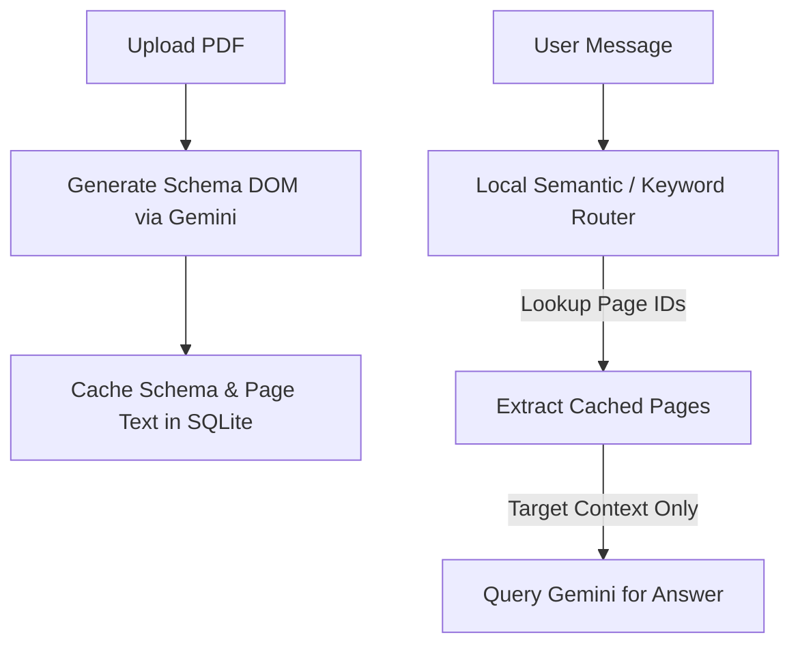

# Proposed Implementation Plan: Hierarchical Document DOM & Semantic Routing RAG

This implementation plan details a highly scalable, low-latency, and cost-efficient Retrieval-Augmented Generation (RAG) architecture for mortgage document auditing over large multi-page PDF packages.

---

## 📐 1. Architectural Strategy

To eliminate high token consumption and circumvent rate-limiting issues on large documents (100+ pages), the architecture splits document processing into two distinct phases:

### Phase 1: Ingestion & Document DOM Building (Run Once)
1. **Document Upload**: The user uploads a mortgage loan package.
2. **Text & Structure Extraction**: Python backend extracts raw page text, physical page geometry, and visual layout structures (like table coordinates).
3. **Index/DOM Construction**: A cheap, high-speed LLM (Gemini 2.5 Flash in batch mode) processes pages once to output a standardized JSON Document Schema (acting as a "Logical DOM").
4. **Caching**: Store the JSON schema and page-level raw text inside a local SQLite/indexed DB.

### Phase 2: Runtime QA & Semantic Routing (Iterated per Query)
1. **Query Input**: User asks a specific question (e.g., *"What is the borrower's gross wage in the 2023 W-2?"*).
2. **Local Schema Matching**: Match query terms against the lightweight JSON Schema using local text similarity (BM25 or small-dimension embeddings).
3. **Retrieval**: Extract raw text for only the matching pages (e.g., Pages 4 & 5) from the cache.
4. **Precise Synthesis**: Query the LLM with only the target pages.

---

## 🛠️ 2. Core Implementation Phases



### Phase A: logical Document Schema Structure
During ingestion, we build a document map structured as follows:

```json
{
  "document_name": "loan_package_john_doe.pdf",
  "total_pages": 12,
  "logical_structure": [
    {
      "page_number": 1,
      "classification": "Bank Statement",
      "summary": "Chase Checking Account Summary, Account Number ending in 4321.",
      "key_entities": ["John Doe", "Chase Bank"],
      "key_numeric_fields": {
        "Starting Balance": "$5,234.12",
        "Ending Balance": "$12,432.00"
      }
    },
    {
      "page_number": 4,
      "classification": "W-2 Wage Statement",
      "summary": "2023 Form W-2 for John Doe, Employer: Infrrd Inc.",
      "key_entities": ["John Doe", "Infrrd Inc.", "2023"],
      "key_numeric_fields": {
        "Wages, Tips, Other Comp": "$95,000.00",
        "Social Security Wages": "$95,000.00"
      }
    }
  ]
}
```

### Phase B: Local Semantic Routing Algorithms
To run the schema routing without paying external API costs or adding heavy dependencies:

1. **BM25 Keyword Router**:
   * Map the JSON schema's values to a corpus index: `[summary + classification + entities]`.
   * Apply a TF-IDF or BM25 ranking algorithm against the incoming user query.
   * Return the top $K$ page numbers matching the token overlap.

2. **Client-Side/Local Sentence Embeddings**:
   * Compute small-dimension embeddings (e.g., 384-dimensional `MiniLM` embeddings) for each page summary.
   * Compute cosine similarity between the query embedding and summaries.
   * Retrieve page IDs scoring above a configurable threshold.

---

## 📈 3. Target Cost & Token Savings Estimation

For a 100-page loan document package (~200,000 tokens) over a standard 10-message audit session:

| Metric | Baseline (Full Text Context) | Schema Routing RAG | Savings |
| :--- | :--- | :--- | :--- |
| **Ingestion Cost** | 0 tokens | 200,000 tokens | — |
| **Chat Session Input** | 2,000,000 tokens | ~70,000 tokens | **96.5% reduction** |
| **Response Latency** | High (5–8s per message) | Low (1–2s per message) | **~75% faster** |
| **Server Cache Footprint** | Large (Full memory context) | Tiny (Key-value DB) | **High scalability** |

---

## 🔮 4. High-Fidelity UI Integrations
This routing pipeline can be visualised in the front-end to build trust with mortgage auditors:
1. **Dynamic Breadcrumbs**: Render `Routing Path: Pages 4, 5` directly above the answer.
2. **Visual Focus Flash**: Briefly highlight/glow matching nodes in the left-hand document hierarchy list (e.g., flashing green on "W-2 Statement") when the query is submitted.
3. **Interactive citations**: Citations remain clickable, taking the user directly to the highlighted page canvas.
